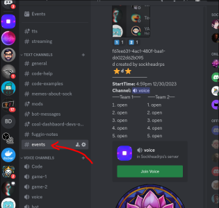
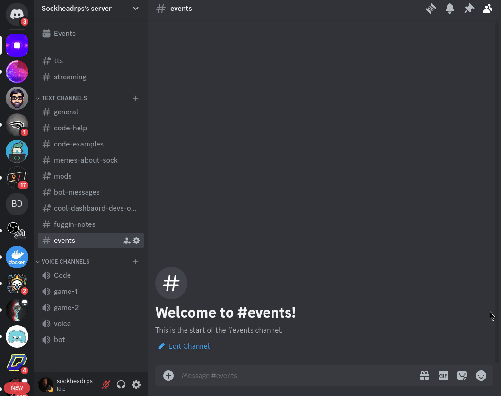
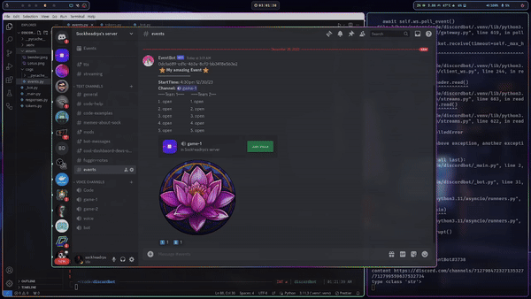

requires an events channel



Intended to be called from events channel (the message will be automatically cleaned up)
```
?event
```

Follow DM prompts



React on the automatically generated :one: and :two: reactions to join / quit a team. Team members generated and inserted on the roster in the message dynamically.


