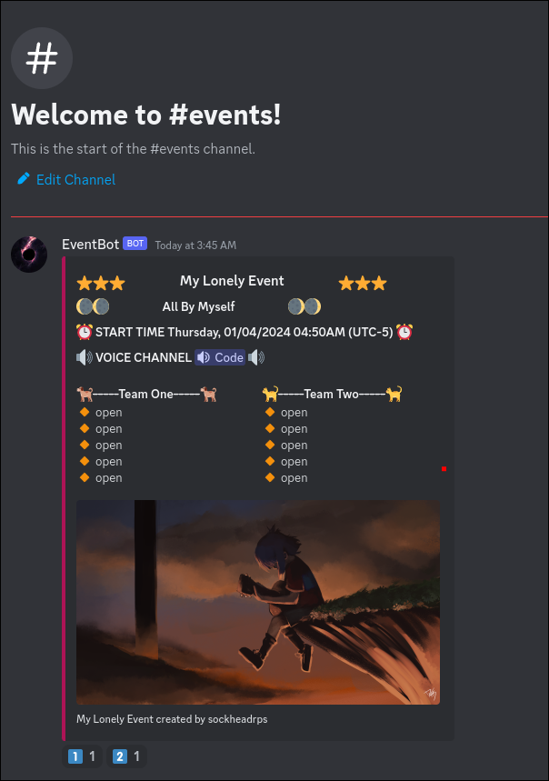
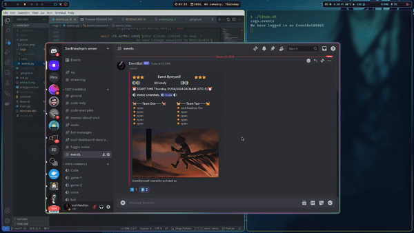

Intended to be called from events channel (the message will be automatically cleaned up)
```
?event
```

Follow DM prompts


React on the automatically generated :one: and :two: reactions to join / quit a team. Team members generated and inserted on the roster in the message dynamically.



## @ Reminders for participants, dynamic team roster



## Running on windows 

Windows: Make a directory EventBot and within it clone the repo:

```sh
mkdir EventBot
cd EventBot
git clone https://github.com/sockheadrps/EventBot.git
```

Go back up a directory and intialize the startup batch file

```sh
cd ..
echo. > run.bat
```

Paste the following code into run.bat, filling in the "TOKEN=" and "EVENT_CHANNEL="
```sh
@echo off
setlocal

set "TOKEN=YOUR_TOKEM"
set "EVENT_CHANNEL=YOUR_EVENT_CHANNEL_ID"


echo Checking for updates
cd EventBot
call git pull
call entrypoint.bat
pause
endlocal
```

Double click run.bat or 
```sh
run.bat
```

## Running on Linux 

```sh
git clone https://github.com/sockheadrps/EventBot.git
cd EventBot
```

*linux.sh*
```sh
#!/bin/bash
export TOKEN="YOUR_TOKEN"
export EVENT_CHANNEL="YOUR_EVENT_CHANNEL_id"
source .venv/bin/activate
python3.11 main.py
```

**Run script**

```sh
./linux.sh
```


